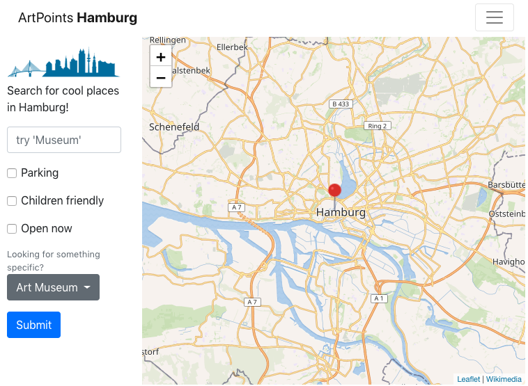

# Art Points in Hamburg

This is a simple test application for filtering and displaying data on a map, built with Node.js, Bootstrap, jQuery, MySQL, Leaflet and some other npm packages.

Dependencies and libraries used in this project:
- MySQL
- Node.js
```
  "dependencies": {
    "bootstrap": "^4.1.3",
    "leaflet": "^1.0.1"
  },
  "devDependencies": {
    "beefy": "^2.1.8",
    "browserify": "^13.1.1"
  }
```

## :round_pushpin: Displaying data

```
var L = require('leaflet');

var map = L.map('map').setView([53.551086, 9.993682], 11);
var Wikimedia = L.tileLayer('https://maps.wikimedia.org/osm-intl/{z}/{x}/{y}{r}.png', {
    attribution: '<a href="https://wikimediafoundation.org/wiki/Maps_Terms_of_Use">Wikimedia</a>',
    maxZoom: 19
}).addTo(map);
```

## :round_pushpin: Preview



## :round_pushpin: Magic with SQL

The group form allows you to either enter an expression you are looking for or to select from a list of available POI types. For querying data with params from url you can use stored procedures such as:

```
  CREATE PROCEDURE GetPoiByType(IN in_type_array VARCHAR(40))
	BEGIN
		SET @sql = CONCAT('SELECT * FROM points_of_interest WHERE type in (', in_type_array, ')');
		PREPARE stmt FROM @sql;
        EXECUTE stmt;
        DEALLOCATE PREPARE stmt;
    END;
```

Usage in MySQL Workbench:

```
SET @type = '1, 2, 4, 5';
CALL GetPoiByType(@type); 
```

or with JavaScript:

```
var connection = mysql.createConnection(config);

function getPoiByType(conn, typesArray) {
    var call = "CALL GetPoiByType(?)";
    connection.query(call, typesArray, (error, results, fields) => {
        if (error) {
            return console.error(error.message);
        }
        console.log(results[0]);
});
}

var types = "1,2";
getPoiByType(connection, types);
```
